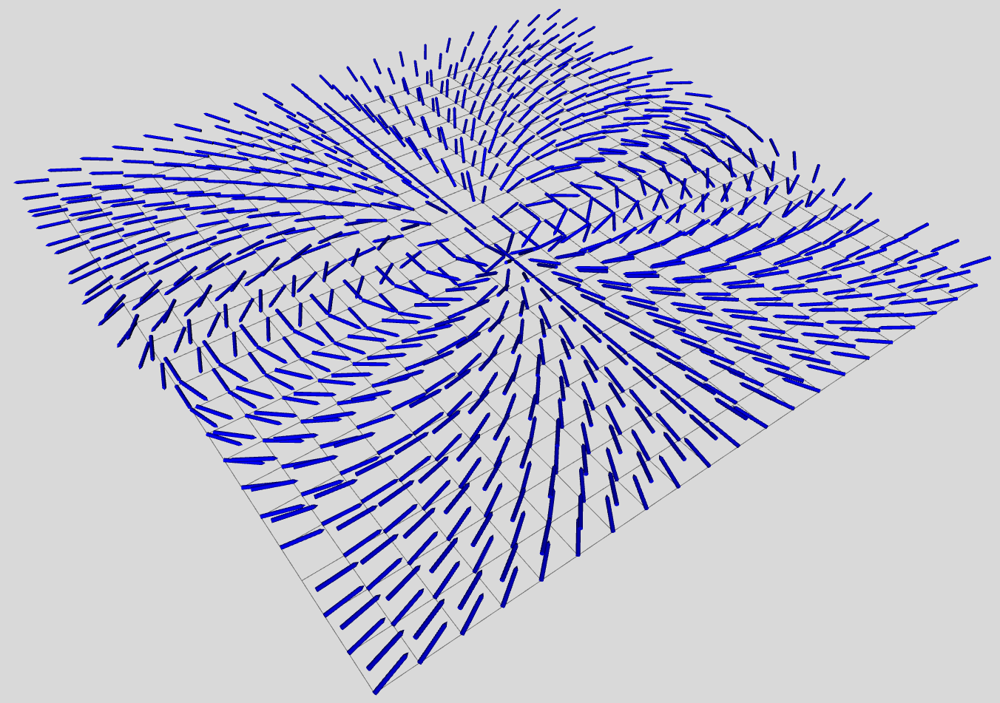
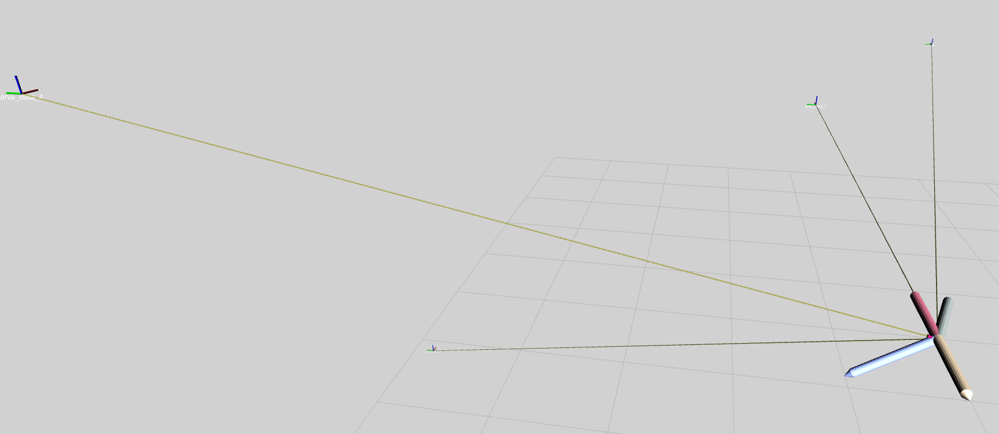

# arva_sim
This ROS package provides the implementation of a Gazebo plugins to simulate the behavior of an [ARVA](https://en.wikipedia.org/wiki/Avalanche_transceiver) transceiver systems. ARVA means _Appareil  de  Recherche  de  Victims  en  Avalanche_ and represents the forefront technology in rescuing avalanche victims. In particular, the proposed package contains two different plugins: the _receiver_ and _transmitter_. 

### Background
ARVA system is one of the forefront technologies nowadays used in _Search & Rescue_ operations in case of avalanches. The ARVA devices consist of two main elements, i.e. a transmitter and a receiver, which are operated alternatively. Excursionists and skiers who use the ARVA normally set in the transmitting mode so that, in the accidental case of avalanche, the system is already set in the right operative mode. In the receiver mode, the ARVA devices provide information about the electromagnetic field, emitted by the transmitter, which is exploited to guide the rescuer toward the victim. 
The working principle of this sensor is based on the detection of the magnetic low-power pulses, emitted by the transmitter. This information is usually made available to the rescuers in terms of magnetic distance and magnetic direction to the victim. An example of the field generated by the receiver sensor at each position of the workspace is shown in the following figure: 



In the previous figure we assume that one transmitter is placed at the center of the workspace.

### Installation instructions
The _arva_sim_ package is compatible both with ROS _kinetci kame_ and _melodic_ distributions. In our context, the main difference in these distributions are related to the ROS Gazebo verison. In particular, the default version of Gazebo ROS installed are Gazebo 7 and 9, respectively. In order to use _arva_sim_ package with ROS kinetic Kame and Gazebo 8, you should the following branch: [Gazebo7](https://github.com/jocacace/arva_sim/tree/gazebo7-devel), while use the following branch [Gazebo9](https://github.com/jocacace/arva_sim/tree/gazebo9-devel) if you ROS system is based on Gazebo 9 instead.

Assuming you are running Ubuntu Linux OS, the installation steps are quite simple as seen below:
1. Install the desired ROS distribution. To install ROS kinetic kame, follow the instraction at this wiki page: [ROS Kinetic](http://wiki.ros.org/kinetic/Installation/Ubuntu), while to install ROS Melodic, following the instructions at: [ROS Melodic installation](http://wiki.ros.org/melodic/Installation/Ubuntu)
2. Setup your ROS catkin workspace, by typing in the 

        $ mkdir -p ∼/catkin_ws/src
        $ cd ∼/catkin_ws
        $ catkin_make
        $ source devel/setup.bash
        
4. Add the following two lines to your bash configuration file (at ~/.bashrc):

        $ source ∼/catkin_ws/devel/setup.bash
        $ export ROS_WORKSPACE=∼/catkin_ws

5. Download and compile _arva_sim_:

        $ roscd; cd src
        $ git clone https://github.com/jocacace/arva_sim.git
        
6. Select your branch. The default branch cloned from the current repository is the gazebo9-devel. I you want to use _arva_sim_ with Gazebo 7 you should switch on the following branch:

        $ roscd arva_sim
        $ git checkout gazebo7-devel 

7. Finally, you mast compile the package:

        $ cd ~/catkin_ws
        $ catkin_make


After compiled this package using the _catkin_make_ command, you are able to endow your robots with the transmitter and receiver modules of the ARVA sensor. 

### Starting with a test

The ARVA plugin can be tested using the sample launch files contained in the _arva_sim_ package. In particular, a set of files has been setup to spawned the whole ARVA system (both receives and transmitter), displaying the output of the sensor.
In particular, to setup the world devoted to host the ARVA system use the following file:

        $ roslaunch arva_sim arva_world.launch

Similarly, it is possible to spawn four transmitters using the following commands:

        $ roslaunch arva_sim spawn_arva_id1.launch
        $ roslaunch arva_sim spawn_arva_id2.launch
        $ roslaunch arva_sim spawn_arva_id3.launch
        $ roslaunch arva_sim spawn_arva_id4.launch
        
And finally, spawn the ARVA receiver:

        $ roslaunch arva_sim spawn_receiver.launch
  
The spawn_receiver.launch file runs RViz and imports a custom configuration file in order to display the output of the arva receiver. The output of the sensor is shown in the next figure. In this context, four ARVA transmitters are placed in the Gazebo world in different locations. The data generated by the ARVA receiver is listed using a set of arrows to describe the direction of each magnetic field flux generated by the transmitters.



#### Configuration
Different parameters are used to configure transmitter and receiver. For the transmitter, an identification number (_id_) and the reference frame of the ARVA data (_frame_id_) can be configured, while for the receivers the following parameters are available:
* channels: The number of simultaneous detectable receivers
* frame_id: The reference frame of the receiver data
* sensor_name: the name of the receiver device

These parameters are specified in the xacro file describing the ARVA modules. One way to set the value of these parameters is to specify their value during the concersion in a URDF file (needed to spawn the object in the gazebo scene). To spawn a receiver able to detect 4 receivers at the same tima, generating data in the _arva_receiver_ reference frame and with name: arva_receiver, paste the following lines in your launch file: 
```xml
<param name="robot_description" command="$(find xacro)/xacro --inorder $(find arva_sim)/urdf/receiver.urdf.xacro channels:=4 frame_id:=arva_receiver sensor_name:=arva_receiver"/>
<node name="spawn_artva_1" pkg="gazebo_ros" type="spawn_model" args="-param robot_description -urdf -x 20.0 -y -5.0 -z 1 -model artva1" 	respawn="false" output="screen" />
```

While, to spawn a transmitter with id 1 generating data in the _world_ reference frame paste the following lines in your launch file:

```xml
<param name="robot_description" command="$(find xacro)/xacro --inorder  $(find arva_sim)/urdf/transmitter.urdf.xacro id:=1 frame_id:=world"/>
<node name="spawn_artva_1" pkg="gazebo_ros" type="spawn_model" args="-param robot_description -urdf -x 20.0 -y -5.0 -z 1 -model artva1" 	respawn="false" output="screen" />
```

#### Output

The output of the _arva_sim_ package is provided using two ROS Topics, one for the signal elaboration and one for the visualization of the ARVA data. The name of such topics depend from the vlaue of the parameters specified in the URDF file. In particular, the transmitter plugin publishes the following topics:
* _arva_sim::arva_:  _$sensor_name_/signal: this topic contains the direction to follow to reach all the received transmitters. This is a custom ROS message implemented in the _arva_sim_ package. The data stracture of the message is defined as follow: 
    ```c
    std_msgs/Header header
      uint32 seq
      time stamp
      string frame_id
    arva_sim/arva_data[] arva_signals
      int32 id
      float32 distance
      geometry_msgs/Vector3 direction
        float64 x
        float64 y
        float64 z
* _visualization_msgs::MarkerArray_: _$sensor_name/visualization_: a set of Rviz markers shaped as arrows indicating the direction of the field
